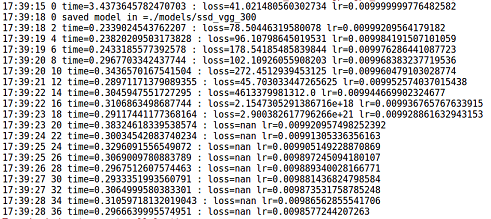
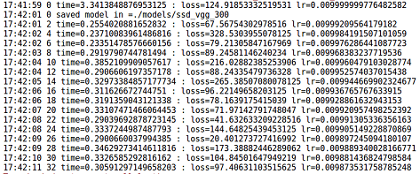

## SSD


### Paper

* [arxiv article](http://arxiv.org/abs/1512.02325)

* [SSD: Single Shot MultiBox Detector](/paper/SSD%20-%20Single%20Shot%20MultiBox%20Detector.pdf)


### Checkpoint

download [ssd_300_vgg.ckpt.zip](https://github.com/balancap/SSD-Tensorflow/tree/master/checkpoints)
unzip in `checkpoints`.


### Run Inference

just run `RunnerSSDOneOrRealTime.py`

* run one image
```python
from nets import ssd_vgg_300
from RunnerSSDOneOrRealTime import RunnerOneOrRealTime
if __name__ == '__main__':
    runner = RunnerOneOrRealTime(ckpt_filename='checkpoints/ssd_300_vgg.ckpt', 
                                 net_model=ssd_vgg_300, num_class=21, net_shape=(300, 300))
    runner.run(image_name="demo/dog.jpg",  result_name="demo/dog_result.png")
```

* run camera
```python
from nets import ssd_vgg_300
from RunnerSSDOneOrRealTime import RunnerOneOrRealTime
if __name__ == '__main__':
    runner = RunnerOneOrRealTime(ckpt_filename='checkpoints/ssd_300_vgg.ckpt', 
                                 net_model=ssd_vgg_300, num_class=21, net_shape=(300, 300))
    runner.run(prop_id=0, size=(960, 840))
```

* run video
```python
from nets import ssd_vgg_300
from RunnerSSDOneOrRealTime import RunnerOneOrRealTime
if __name__ == '__main__':
    runner = RunnerOneOrRealTime(ckpt_filename='checkpoints/ssd_300_vgg.ckpt', 
                                 net_model=ssd_vgg_300, num_class=21, net_shape=(300, 300))
    runner.run(prop_id="demo/video1.mp4")
```


### Result Inference

| image | result |
| --- | --- |
|  |  |
|  |  |


### Data

0. download voc data
```bash
# download the data
wget http://host.robots.ox.ac.uk/pascal/VOC/voc2012/VOCtrainval_11-May-2012.tar
wget http://host.robots.ox.ac.uk/pascal/VOC/voc2007/VOCtrainval_06-Nov-2007.tar
wget http://host.robots.ox.ac.uk/pascal/VOC/voc2007/VOCtest_06-Nov-2007.tar
# Extract the data.
tar -xvf VOCtrainval_11-May-2012.tar
tar -xvf VOCtrainval_06-Nov-2007.tar
tar -xvf VOCtest_06-Nov-2007.tar
```

1. set `dataset_dir` in `data/tf_convert_data.py` with you path or other param you need to change.

2. run `data/tf_convert_data.py`  to convert voc data to tfrecord

3. run `data/show_data.py` to show image and bounding boxes


### Caffe models to Tensorflow checkpoints

* [download caffe models](https://github.com/weiliu89/caffe/tree/ssd#models) unzip in `caffemodels`.

* just run `changemodels/cfaae_to_tensorflow.py` to convert model.

```python
from nets import ssd_vgg_300
from changemodels.caffe_to_tensorflow import ConvertCaffeToTensorflow
if __name__ == '__main__':
    ConvertCaffeToTensorflow(net_model=ssd_vgg_300,
                             caffemodel_path="../caffemodels/VGG_VOC0712_SSD_300x300/"
                                             "VGG_VOC0712_SSD_300x300_iter_120000.caffemodel",
                             ckpt_path="../checkpoints/VGG_VOC0712_SSD_300x300.ckpt").convert()
```
or
```python
from nets import ssd_vgg_512
from changemodels.caffe_to_tensorflow import ConvertCaffeToTensorflow
if __name__ == '__main__':
    ConvertCaffeToTensorflow(net_model=ssd_vgg_512,
                             caffemodel_path="../caffemodels/VGG_VOC0712Plus_SSD_512x512_ft/"
                                             "VGG_VOC0712Plus_SSD_512x512_ft_iter_160000.caffemodel",
                             ckpt_path="../checkpoints/VGG_VOC0712Plus_SSD_512x512.ckpt").convert()
```


### Eval

1. After run `Train Data`, set data path in `RunnerEval.__init__(dataset_dir="", dataset_split_name="test")`

2. After run `Checkpoint` or have Checkpoints, set `ckpt_path` in `RunnerEval.__init__(ckpt_path="")`

3. Just run below.

```python
from RunnerSSDEval import RunnerEval
if __name__ == '__main__':
    runner = RunnerEval()
    runner.eval_demo()
```


### Train

* Just set you argument in class `RunnerTrain` and run `RunnerSSDTrain.py`.


> 一直出現损失为nan的情况，经过一天....的找原因发现是优化求解出现了问题

```python
# 用RMSP优化会出现问题
optimizer = tf.train.RMSPropOptimizer(learning_rate, decay=0.9, momentum=0.9, epsilon=1.0)
```




```python
# 改用Adam
optimizer = tf.train.AdamOptimizer(learning_rate, beta1=0.9, beta2=0.999, epsilon=1.0)
```




### Loss


### Reference

* [balancap/SSD-Tensorflow](https://github.com/balancap/SSD-Tensorflow)

