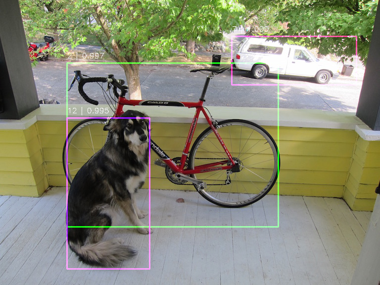
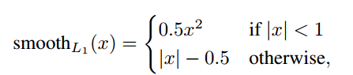

## SSD


### Paper

* [arxiv article](http://arxiv.org/abs/1512.02325)

* [SSD: Single Shot MultiBox Detector](/paper/SSD%20-%20Single%20Shot%20MultiBox%20Detector.pdf)


### Checkpoint

download [ssd_300_vgg.ckpt.zip](https://github.com/balancap/SSD-Tensorflow/tree/master/checkpoints)
unzip in `checkpoints`.


### Run Inference

just run `RunnerSSDOneOrRealTime.py`

* run one image
```python
from nets import ssd_vgg_300
from RunnerSSDOneOrRealTime import RunnerOneOrRealTime
if __name__ == '__main__':
    runner = RunnerOneOrRealTime(ckpt_filename='checkpoints/ssd_300_vgg.ckpt', 
                                 net_model=ssd_vgg_300, num_class=21, net_shape=(300, 300))
    runner.run(image_name="demo/dog.jpg",  result_name="demo/dog_result.png")
```

* run camera
```python
from nets import ssd_vgg_300
from RunnerSSDOneOrRealTime import RunnerOneOrRealTime
if __name__ == '__main__':
    runner = RunnerOneOrRealTime(ckpt_filename='checkpoints/ssd_300_vgg.ckpt', 
                                 net_model=ssd_vgg_300, num_class=21, net_shape=(300, 300))
    runner.run(prop_id=0, size=(960, 840))
```

* run video
```python
from nets import ssd_vgg_300
from RunnerSSDOneOrRealTime import RunnerOneOrRealTime
if __name__ == '__main__':
    runner = RunnerOneOrRealTime(ckpt_filename='checkpoints/ssd_300_vgg.ckpt', 
                                 net_model=ssd_vgg_300, num_class=21, net_shape=(300, 300))
    runner.run(prop_id="demo/video1.mp4")
```


### Result Inference

| image | result |
| --- | --- |
|  |  |
|  |  |


### Data

0. download voc data
```bash
# download the data
wget http://host.robots.ox.ac.uk/pascal/VOC/voc2012/VOCtrainval_11-May-2012.tar
wget http://host.robots.ox.ac.uk/pascal/VOC/voc2007/VOCtrainval_06-Nov-2007.tar
wget http://host.robots.ox.ac.uk/pascal/VOC/voc2007/VOCtest_06-Nov-2007.tar
# Extract the data.
tar -xvf VOCtrainval_11-May-2012.tar
tar -xvf VOCtrainval_06-Nov-2007.tar
tar -xvf VOCtest_06-Nov-2007.tar
```

1. set `dataset_dir` in `data/tf_convert_data.py` with you path or other param you need to change.

2. run `data/tf_convert_data.py`  to convert voc data to tfrecord

3. run `data/show_data.py` to show image and bounding boxes


### Caffe models to Tensorflow checkpoints

* [download caffe models](https://github.com/weiliu89/caffe/tree/ssd#models) unzip in `caffemodels`.

* just run `changemodels/cfaae_to_tensorflow.py` to convert model.

```python
from nets import ssd_vgg_300
from changemodels.caffe_to_tensorflow import ConvertCaffeToTensorflow
if __name__ == '__main__':
    ConvertCaffeToTensorflow(net_model=ssd_vgg_300,
                             caffemodel_path="../caffemodels/VGG_VOC0712_SSD_300x300/"
                                             "VGG_VOC0712_SSD_300x300_iter_120000.caffemodel",
                             ckpt_path="../checkpoints/VGG_VOC0712_SSD_300x300.ckpt").convert()
```
or
```python
from nets import ssd_vgg_512
from changemodels.caffe_to_tensorflow import ConvertCaffeToTensorflow
if __name__ == '__main__':
    ConvertCaffeToTensorflow(net_model=ssd_vgg_512,
                             caffemodel_path="../caffemodels/VGG_VOC0712Plus_SSD_512x512_ft/"
                                             "VGG_VOC0712Plus_SSD_512x512_ft_iter_160000.caffemodel",
                             ckpt_path="../checkpoints/VGG_VOC0712Plus_SSD_512x512.ckpt").convert()
```


### Eval

1. After run `Train Data`, set data path in `RunnerEval.__init__(dataset_dir="", dataset_split_name="test")`

2. After run `Checkpoint` or have Checkpoints, set `ckpt_path` in `RunnerEval.__init__(ckpt_path="")`

3. Just run below.

```python
from RunnerSSDEval import RunnerEval
if __name__ == '__main__':
    runner = RunnerEval()
    runner.eval_demo()
```


### Train and Fine-tuning

**有四种训练方式**

1. `run_type=1`：从头开始训练
2. `run_type=2`：从SSD模型开始训练
3. `run_type=3`：从ImageNet模型开始训练
4. `run_type=4`：从ImageNet模型开始训练，且固定ImageNet的参数来训练指定的scope。达到要求后，可以转`run_type=2`。


#### 1. 从头开始训练

* Just run `RunnerSSDTrain.py` as below:
```python
from RunnerSSDTrain import RunnerTrain

# run_type=1：从0开始训练
# run_type=2：从SSD模型开始训练
def run_type_1_or_2():
    # 1和2的区别只是在ckpt_path下有没有训练好的模型
    runner = RunnerTrain(run_type=1, ckpt_path="./models/ssd_vgg_300_1", ckpt_name="ssd_300_vgg.ckpt",
                         batch_size=8, learning_rate=0.01, end_learning_rate=0.00001)
    runner.train_demo(num_batches=100000, print_1_freq=10, save_model_freq=100)
    pass
    
if __name__ == '__main__':
    run_type_1_or_2()
```

#### 2. 从SSD模型开始训练

1. 完成`Caffe models to Tensorflow checkpoints`。

2. 将训练好的SSD模型放在`RunnerTrain`中`ckpt_path`和`ckpt_name`指定的目录。

3. 适当的调整参数，run `RunnerSSDTrain` as below:
```python
from RunnerSSDTrain import RunnerTrain

# run_type=1：从0开始训练
# run_type=2：从SSD模型开始训练
def run_type_1_or_2():
    # 1和2的区别只是在ckpt_path下有没有训练好的模型
    runner = RunnerTrain(run_type=1, ckpt_path="./models/ssd_vgg_300", ckpt_name="ssd_300_vgg.ckpt",
                         batch_size=8, learning_rate=0.001, end_learning_rate=0.00001)
    runner.train_demo(num_batches=100000, print_1_freq=10, save_model_freq=1000)
    pass
    
if __name__ == '__main__':
    run_type_1_or_2()
```

4. 学习率的影响

    * 当调整学习率参数为很小（例如，learning_rate=0.0001, end_learning_rate=0.00001）时，结果很好。
    ```python
    from RunnerSSDTrain import RunnerTrain
    if __name__ == '__main__':
        runner = RunnerTrain(run_type=2, ckpt_path="./models/ssd_vgg_300", ckpt_name="ssd_300_vgg.ckpt",
                             batch_size=8, learning_rate=0.0001, end_learning_rate=0.00001)
        runner.train_demo(num_batches=10000, print_1_freq=10, save_model_freq=1000)
    ```

   * 当调整学习率参数为很大（例如，learning_rate=0.01, end_learning_rate=0.00001）时，结果一开始会不好，然后会慢慢收敛。
    ```python
    from RunnerSSDTrain import RunnerTrain
    if __name__ == '__main__':
        runner = RunnerTrain(run_type=2, ckpt_path="./models/ssd_vgg_300", ckpt_name="ssd_300_vgg.ckpt",
                             batch_size=8, learning_rate=0.01, end_learning_rate=0.00001)
        runner.train_demo(num_batches=10000, print_1_freq=10, save_model_freq=1000)
    ```


#### 从ImageNet模型开始训练

1. 下载ImageNet预训练模型：[models/slim#pre-trained-models](https://github.com/tensorflow/models/tree/master/research/slim#pre-trained-models) / 
[VGG16](http://download.tensorflow.org/models/vgg_16_2016_08_28.tar.gz)

2. 只加载SSD中属于原始架构可训练变量的权值/剩下的可训练变量随机初始化。
```python
# 从ImageNet模型恢复:exclude_scopes指定要恢复的变量
def restore_image_net_if_y(self, image_net_ckpt_model_file, exclude_scopes, image_net_ckpt_model_scope="vgg_16"):
    variables_to_restore = []
    for var in tf.model_variables():  # 遍历所有的模型变量
        excluded = False
        for exclusion in exclude_scopes:  # 判断该变量是否被排除
            if var.op.name.startswith(exclusion):
                excluded = True
                break
            pass
        if not excluded:  # 如果不在exclude_scopes中,则需要restore
            variables_to_restore.append(var)
        pass

    if image_net_ckpt_model_scope:
        # Change model scope if necessary.
        variables_to_restore = {var.op.name.replace(self.net_model_scope, image_net_ckpt_model_scope): var
                                for var in variables_to_restore}
        pass

    if image_net_ckpt_model_file is None:
        self.print_info('No ImageNet ckpt file found.')
    else:
        restore_fn = slim.assign_from_checkpoint_fn(image_net_ckpt_model_file,
                                                    variables_to_restore, ignore_missing_vars=True)
        restore_fn(self.sess)

        self.print_info("Just Restored the variable that included not in Exclude_Scopes.")
        self.print_info("Restored model parameters from {}".format(image_net_ckpt_model_file))
    pass
```

3. 同时训练上述两种权值，run `RunnerSSDTrain` as below:
```python
from RunnerSSDTrain import RunnerTrain

# run_type=3：从ImageNet模型开始训练
def run_type_3():
    runner = RunnerTrain(run_type=3, ckpt_path="./models/ssd_vgg_300_3", ckpt_name="ssd_300_vgg.ckpt",
                         image_net_ckpt_model_file="./models/vgg/vgg_16.ckpt",
                         batch_size=8, learning_rate=0.01, end_learning_rate=0.00001)
    runner.train_demo(num_batches=100000, print_1_freq=10, save_model_freq=1000)
    pass
    
if __name__ == '__main__':
    run_type_3()
```


#### 从ImageNet模型开始训练，且固定ImageNet的参数来训练指定的scope。达到要求后，可以转`run_type=2`。

1. 同`从ImageNet模型开始训练`

2. 同`从ImageNet模型开始训练`

3. 先固定加载的权值，训练随机初始化的变量
```python
def get_variables_to_train(self, trainable_scopes):
    if trainable_scopes is None:
        return tf.trainable_variables()

    variables_to_train = []
    for scope in trainable_scopes:
        variables = tf.get_collection(tf.GraphKeys.TRAINABLE_VARIABLES, scope)
        variables_to_train.extend(variables)
        pass
    
    self.print_info("Just train the variable that included in Trainable_Scopes.")
    return variables_to_train
```

4.训练网络，当网络收敛到一个较好的结果时再微调整个网络，run `RunnerSSDTrain` as below:
```python
from RunnerSSDTrain import RunnerTrain

# run_type=4：从ImageNet模型开始训练，且固定ImageNet的参数来训练指定的scope。达到要求后，可以转run_type=2
def run_type_4():
    runner = RunnerTrain(run_type=4, ckpt_path="./models/ssd_vgg_300_4", ckpt_name="ssd_300_vgg.ckpt",
                         image_net_ckpt_model_file="./models/vgg/vgg_16.ckpt",
                         batch_size=8, learning_rate=0.001, end_learning_rate=0.00001)
    runner.train_demo(num_batches=100000, print_1_freq=10, save_model_freq=1000)
    pass
    
if __name__ == '__main__':
    run_type_4()
```
   
5. 微调整个网络就相当于`从SSD训练好的模型开始`，且其学习率较小，run `RunnerSSDTrain` as below:
```python
from RunnerSSDTrain import RunnerTrain
if __name__ == '__main__':
    runner = RunnerTrain(run_type=2, ckpt_path="./models/ssd_vgg_300", ckpt_name="ssd_300_vgg.ckpt",
                         batch_size=8, learning_rate=0.0001, end_learning_rate=0.00001)
    runner.train_demo(num_batches=10000, print_1_freq=10, save_model_freq=1000)
```


#### 一直出現损失为nan的情况，经过一天....的找原因发现是优化求解出现了问题

```python
# 用RMSP优化会出现问题
optimizer = tf.train.RMSPropOptimizer(learning_rate, decay=0.9, momentum=0.9, epsilon=1.0)
```


```python
# 改用Adam
optimizer = tf.train.AdamOptimizer(learning_rate, beta1=0.9, beta2=0.999, epsilon=1.0)
```


### Training objective

* 整体的目标函数(the overall objective loss)是定位损失(the localization loss)和置信损失(the confidence loss)的加权和(weighted sum)




其中：
   1. `c`是所有匹配的框的预测得分。`c_i_p`是第i个匹配的默认框是第p类的得分。
   2. `N`是匹配的默认框的个数(the number of matched default boxes),如果N为0则设置loss为0。权重项α设为1。
   3. `x`是标记，对于一张图片，其值是确定的。`x_i_j_p`标记是否是`匹配的第i个默认框是第j个真实框且类别为p`(即：在框内的对象是哪一类)。
   `x_i_j_k`标记是否是`匹配的第i个默认框是第j个真实框`(即：这个框的边界是多少。此时计算的是边界，不管类别，所以k代表所有类别)。
   需要说明的是：`在编码过程中，匹配的默认框修改成了真实框`。
   4. `L_conf`是softmax loss over multiple classes confidences，即计算`匹配的正默认框为正样本的可能性`和`匹配的负默认框为负样本的可能性`（对得分进行了归一）。
   5. `L_loc`是对默认框中心和宽高的回归(regress to offsets for the center(cx,cy),width(w) and height(h) of the default bounding box)。
   6. `L_loc`是预测框(the predicted box (l),编码中修改了默认框)和真实框(the ground truth box (g))的`Smooth L1`。
   7. 定位损失目标是最小化`L_loc`,所以根据`Smooth L1`公式，`smooth_l1`的两个参数越接近越好。
   因此，对于`cx`和`cy`采用`偏离中心占默认框的比例`作为度量方式，对于`width`和`height`采用`预测和真实之间比例的对数`作为度量方式。
   8. 预测框(the predicted box,l)、默认框(the default box,d)、真实框(the ground truth,g)，预测中心(center(cx,cy))、预测宽度(w)、预测高度(h)。
   9. 以上理解可能有误。


### 筛选框


### 标签编码


### Reference

* [balancap/SSD-Tensorflow](https://github.com/balancap/SSD-Tensorflow)

